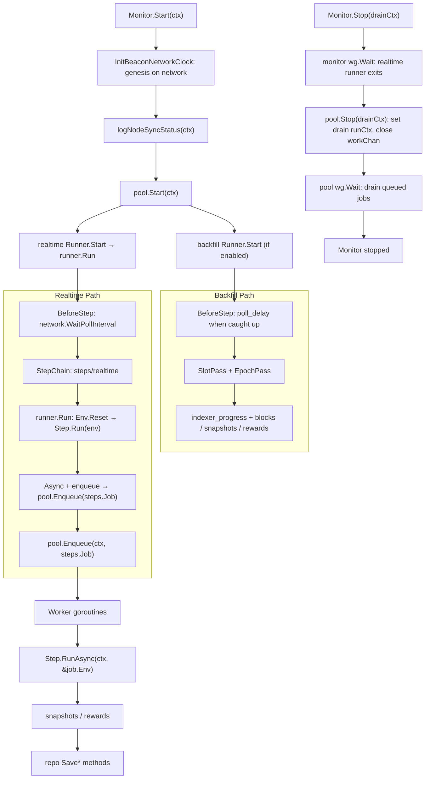
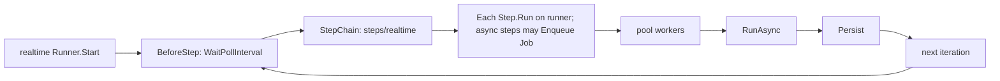
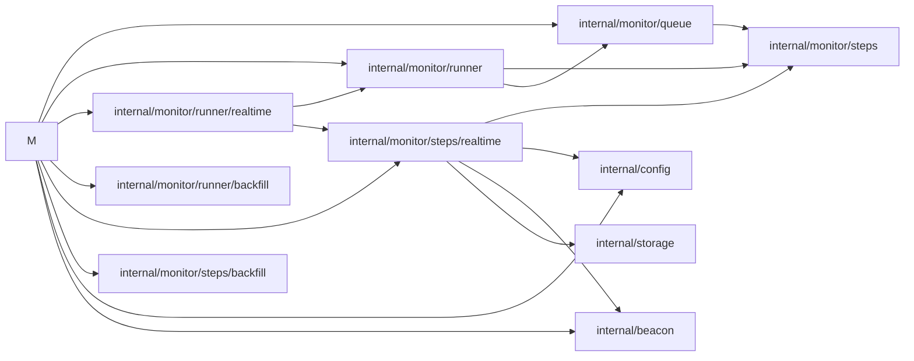

# Monitor E2E Interaction Flow

Mental model: **Monitor** owns genesis init, starts **queue.Pool** workers, and background **`runner.Runner.Start`** goroutines for **realtime** and (when `backfill.enabled`) **backfill**. Realtime uses **BlockchainNetwork** pacing and **`lastProcessedSlot`**; **BlockIndexer** marks **`indexer_progress`** (`kind=slot`) after async success. Backfill runs **SlotPass** (gap scan via `FirstUnindexedSlot`, up to `slots_per_pass` slots behind `head - lag`) and **EpochPass** (`FirstUnindexedEpoch`, all-validator epoch data). **`runner.Run`** drives **BeforeStep → `StepChain` → `Env().Reset` → step runs → `Enqueue`** until **`ctx`** is done. **Errors and lifecycle** log at default level; **per-request / step detail** needs **`-debug`**.

## Realtime monitoring (single linear flow)

**In one sentence:** `runner/realtime.Runner` wires wait + **`steps/realtime`** step chain — **RealtimeEnvBootstrap** (head + validators on **`Env`**); then **AttestationRewards** and **BlockIndexer** (async when each step’s **`Run`** enqueues), then **RecordLastProcessedSlot** (sync: commits **`lastProcessedSlot`** for head dedup on the next poll).

## Module and package call graph

## Startup

1. `Monitor.Start(ctx)` runs `InitBeaconNetworkClock`, checks node sync (debug).
2. Starts `queue.Pool` workers with `queue.StepJobRunner` (each job runs `Step.RunAsync`).
3. Spawns **realtime** `runner.Runner.Start` on a background goroutine.
4. When `backfill.enabled`, spawns **backfill** `runner/backfill.Runner.Start` (slot + epoch passes).

## Realtime loop

1. `runner/realtime.Runner.Start(ctx)` calls `runner.Run(ctx, m)` until `ctx` is done.
2. `BeforeStep`: `BlockchainNetwork.WaitPollInterval`.
3. `StepChain`: **`steps/realtime`** — **RealtimeEnvBootstrap** (sync), **AttestationRewards** and **BlockIndexer** (async; may enqueue), **RecordLastProcessedSlot** (sync).
4. `runner.Run`: `m.Env()` then `Reset(ctx)`, then each `steps.Step.Run(env)`; if **`Async()`** and **`Run` returns `enqueue=true`**, it **`m.Enqueue` / `pool.Enqueue`** a **`steps.Job{Step, Env.Clone()}`**.

## Execution path

1. Workers dequeue **`steps.Job`**.
2. **`Step.RunAsync(ctx, &job.Env)`** runs the async body (snapshots or attestation rewards in `internal/monitor/steps/realtime`).
3. Data is written through `storage.Repository` (failures log at **error** by default; more detail with `-debug`).

## Shutdown

1. Cancel the monitor **context** (stops the realtime runner loop; no further `Enqueue`).
2. `Monitor.Stop(drainCtx)` waits for the **realtime runner** goroutine, then `pool.Stop(drainCtx)`.
3. The pool sets **`runCtx` to `drainCtx`**, **closes `workChan`**, and workers **drain the buffer** (they no longer exit early on the cancelled monitor context). **`RunAsync`** uses **`drainCtx`** so work can finish or abort when the shutdown deadline fires.
