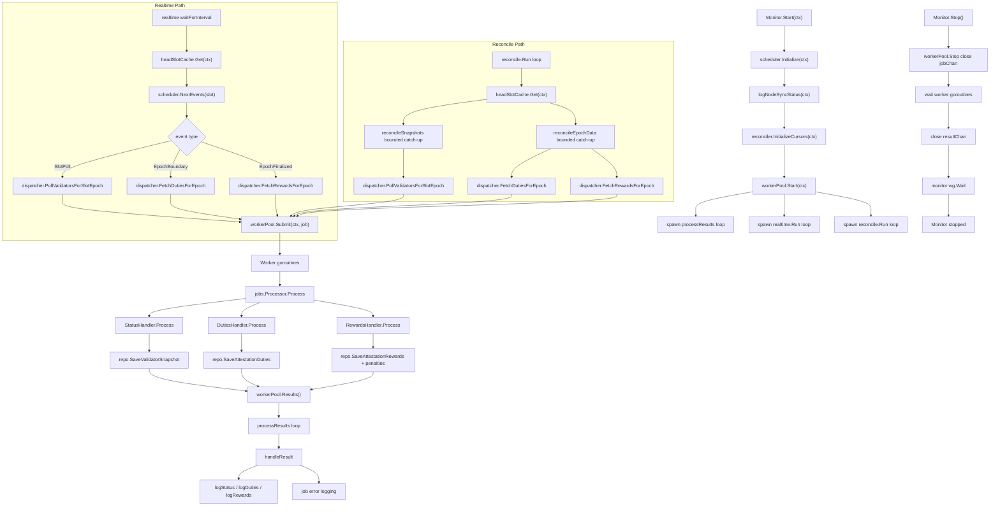
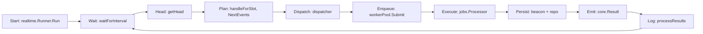
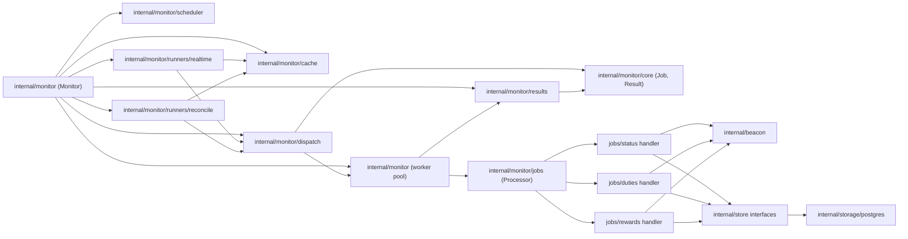

# Monitor E2E Interaction Flow

## Realtime monitoring (single linear flow)

End-to-end path for the **realtime** loop only: pacing → head → schedule → enqueue → work → log.

**In one sentence:** the realtime goroutine wakes on each interval, reads the head slot, turns that slot into scheduled events and dispatcher calls, workers fetch and persist, results are emitted and logged—then the cycle repeats until `ctx` is done.

## Module and package call graph

This view focuses on **which package calls which package**.

## Startup

1. `Monitor.Start(ctx)` initializes scheduler, logs node sync status, and initializes reconciliation cursors.
2. Starts worker pool.
3. Spawns three long-running goroutines:
   - realtime runner
   - reconcile runner
   - result processor

## Realtime Path

1. Realtime runner waits for interval.
2. Reads current slot from head-slot cache.
3. Asks scheduler for events at current slot.
4. Dispatches events into jobs through dispatcher.
5. Jobs are enqueued into worker pool.

## Reconcile Path

1. Reconcile runner reads head slot from cache.
2. Runs bounded catch-up for snapshots and epoch data.
3. Uses dispatcher to enqueue corresponding jobs.
4. Repeats until caught up (or context canceled).

## Job Execution Path

1. Workers consume jobs from queue.
2. `jobs.Processor` routes to job-specific handler:
   - status
   - duties
   - rewards
3. Handler fetches beacon data and writes to repository.

## Result Processing Path

1. Worker emits `core.Result` to result channel.
2. `processResults` consumes results.
3. Logs success payloads or failure details.

## Shutdown

1. `Monitor.Stop()` calls `workerPool.Stop()`.
2. Job channel closes, workers drain and exit.
3. Result channel closes.
4. `wg.Wait()` waits for all monitor goroutines to finish.
5. Monitor reports stopped.
