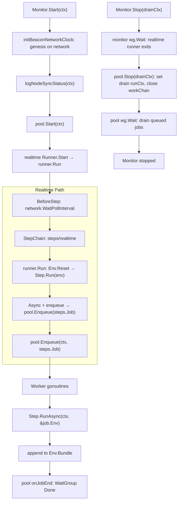
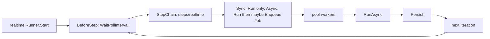
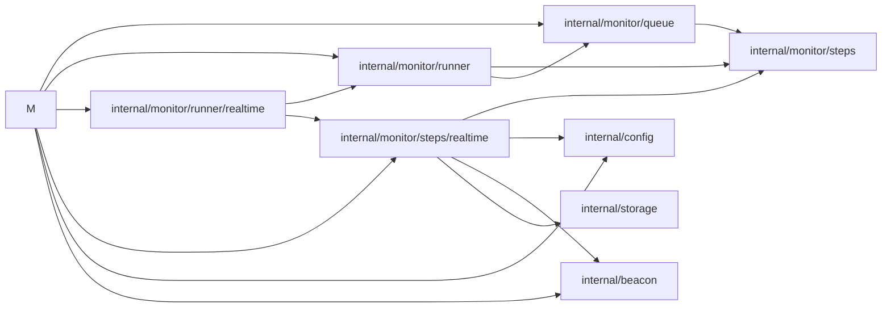

# Monitor E2E Interaction Flow

Mental model: **Monitor** owns genesis init, starts **queue.Pool** workers, and one background **`runner.Runner.Start`** for realtime (`runner/realtime.Runner` implements **`runner.Runner`** and calls **`runner.Run(ctx, m)`**). The realtime runner owns **BlockchainNetwork** pacing, **lastEpoch** for boundary dedup, and returns concrete **`steps.Step`** values from **`steps/realtime`**. **`runner.Run`** drives **BeforeStep → `StepChain` → `Env().Reset` → step runs → `Enqueue`** until **`ctx`** is done. **BeforeStep** (wait), then the chain — **sync** steps run entirely on the runner goroutine; **async** steps enqueue a **`steps.Job`** (the step plus a cloned **`Env`**) when **`Run` returns `enqueue=true`**. **`Env.Bundle`** (`storage.PersistBundle`) is shared by reference across clones: async steps **append** fetched rows only; the sync **`Persist`** step **`WaitGroup`-waits** for all async jobs for this tick (pool **`SetOnJobEnd`**) then runs **`Repository.PersistTick`** in **one transaction**. If any **`RunAsync`** fails, the bundle records **`AsyncError`** and **Persist skips the DB write** (whole tick aborted). Historical catch-up / backfill is **not** implemented yet. **Errors and lifecycle** log at default level; **per-request / step detail** needs **`-debug`**.

## Realtime monitoring (single linear flow)

**In one sentence:** `runner/realtime.Runner` wires wait + **`steps/realtime`** step chain — **GetValidatorDetails** (sync: head, validator copy, boundary plan); then **ValidatorsBalanceAtSlot**, **ValidatorDuties**, **AttestationRewardsAtBoundary** (async; enqueue a **Job** when **`Run` schedules work**); finally **Persist** (sync: wait for async jobs, then **`PersistTick`**).

## Module and package call graph

## Startup

1. `Monitor.Start(ctx)` runs `initBeaconNetworkClock`, checks node sync (debug).
2. Starts `queue.Pool` workers with `queue.StepJobRunner` (each job runs `Step.RunAsync`).
3. Spawns **realtime** `runner.Runner.Start` on a background goroutine.

## Realtime loop

1. `runner/realtime.Runner.Start(ctx)` calls `runner.Run(ctx, m)` until `ctx` is done.
2. `BeforeStep`: `BlockchainNetwork.WaitPollInterval`.
3. `StepChain`: **`steps/realtime`** — **GetValidatorDetails** (sync, runner-owned `lastEpoch`), **ValidatorsBalanceAtSlot**, **ValidatorDuties**, **AttestationRewardsAtBoundary** (async), **Persist** (sync).
4. `runner.Run`: `m.Env()` then `Reset(ctx)` (new **`Bundle`**), then each `steps.Step.Run(env)`; if **`Async()`** and **`Run` returns `enqueue=true`**, it **`m.Enqueue` / `pool.Enqueue`** a **`steps.Job{Step, Env.Clone()}`** (clone shares **`Bundle` pointer**). **`Monitor`** wraps `Enqueue` with **`WaitGroup.Add(1)`** and registers **`pool.SetOnJobEnd(Done)`**.

## Execution path

1. Workers dequeue **`steps.Job`**.
2. **`Step.RunAsync(ctx, &job.Env)`** runs the async body (fetch only; append into **`Env.Bundle`** in `internal/monitor/steps/realtime`). Failures set **`Bundle.RecordAsyncError`** and log at **error** (more detail with `-debug`).
3. After async steps enqueue, **`Persist.Run`** waits on the tick **`WaitGroup`**, then **`Repository.PersistTick`** commits snapshots, duties, rewards, and penalties in **one transaction** (skipped if **`AsyncError`** is set).

## Shutdown

1. Cancel the monitor **context** (stops the realtime runner loop; no further `Enqueue`).
2. `Monitor.Stop(drainCtx)` waits for the **realtime runner** goroutine, then `pool.Stop(drainCtx)`.
3. The pool sets **`runCtx` to `drainCtx`**, **closes `workChan`**, and workers **drain the buffer** (they no longer exit early on the cancelled monitor context). **`RunAsync`** uses **`drainCtx`** so work can finish or abort when the shutdown deadline fires.
