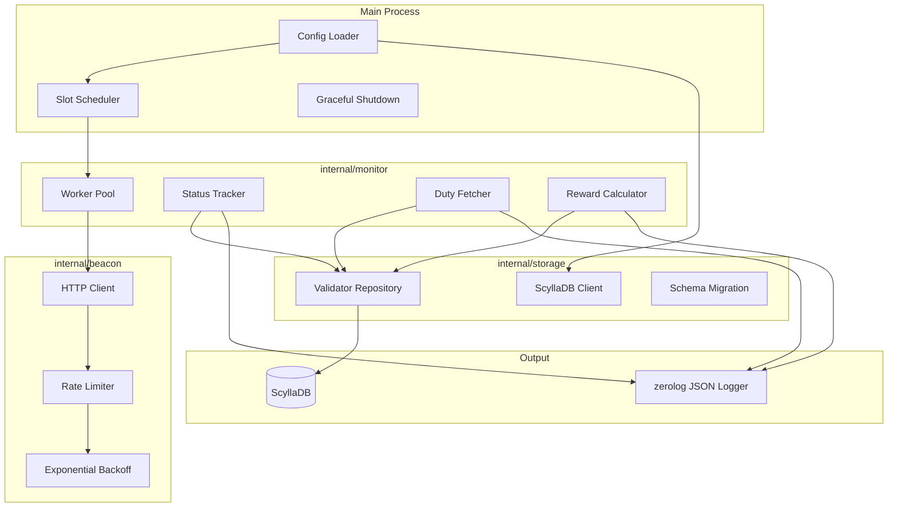
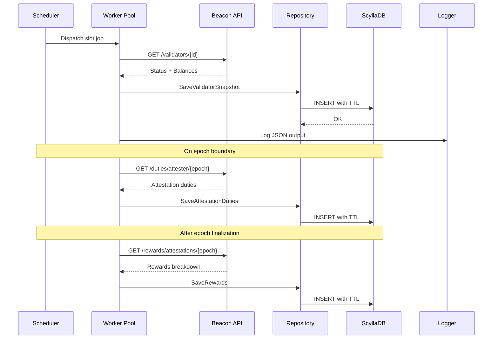
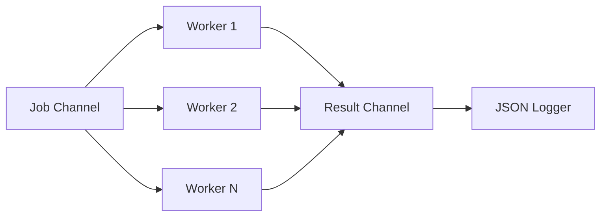

# Ethereum Validator Monitor in Go

## Architecture Overview



## Data Flow



## Project Structure

```
pauli/
├── main.go                      # Entry point, graceful shutdown
├── go.mod
├── go.sum
├── config.yaml                  # Example configuration
├── internal/
│   ├── config/
│   │   └── config.go            # YAML config loader
│   ├── beacon/
│   │   ├── client.go            # HTTP client with connection pooling
│   │   ├── types.go             # API response structs
│   │   ├── validators.go        # Validator status endpoint
│   │   ├── duties.go            # Attestation duties endpoint
│   │   └── rewards.go           # Attestation rewards endpoint
│   ├── storage/
│   │   ├── scylla.go            # ScyllaDB client and connection
│   │   ├── migrations.go        # Schema auto-migration
│   │   ├── models.go            # Database models
│   │   └── repository.go        # Data access layer
│   └── monitor/
│       ├── monitor.go           # Core monitoring loop
│       ├── worker.go            # Worker pool implementation
│       └── scheduler.go         # Slot-based scheduling
└── pkg/
    └── backoff/
        └── backoff.go           # Exponential backoff utility
```

## Key Implementation Details

### 1. Configuration (YAML)

```yaml
beacon_node_url: "http://localhost:5052"
validators:
  - 12345
  - 67890
  - 111213
polling_interval_slots: 1        # Poll every slot (12s)
worker_pool_size: 10
rate_limit:
  requests_per_second: 50
  burst: 100
http:
  timeout_seconds: 30
  max_idle_conns: 100

# ScyllaDB Configuration
scylladb:
  hosts:
    - "127.0.0.1:9042"
  keyspace: "validator_monitor"
  replication_factor: 3
  consistency: "local_quorum"    # For sync writes
  timeout_seconds: 10
  max_retries: 3
  ttl_days: 90                   # Configurable data retention
```

### 2. High-Performance HTTP Client

- Use `net/http` with optimized `Transport` settings:
                                                                - `MaxIdleConns: 100`
                                                                - `MaxIdleConnsPerHost: 100`
                                                                - `IdleConnTimeout: 90s`
                                                                - HTTP/2 enabled by default
- Implement token bucket rate limiter using `golang.org/x/time/rate`
- Pre-allocate buffers for JSON decoding

### 3. Worker Pool Pattern

- Fixed pool of N goroutines (configurable, default 10)
- Job channel distributes validator indices to workers
- Result channel collects monitoring results
- Prevents goroutine explosion when monitoring 100+ validators



### 4. Exponential Backoff

Handle `429` and `503` errors with:

- Initial delay: 100ms
- Max delay: 30s
- Multiplier: 2x
- Jitter: +/- 20%

### 5. Monitor Loop (per epoch/slot)

1. **On each slot**: Fetch validator status and effective balance
2. **On epoch boundary**: Fetch attestation duties for next epoch
3. **After epoch finalization**: Fetch attestation rewards for previous epoch

### 6. JSON Log Output Format

```json
{
  "level": "info",
  "time": "2026-01-16T10:00:00Z",
  "slot": 1234567,
  "validator_index": 12345,
  "status": "active_ongoing",
  "effective_balance_gwei": 64000000000,
  "duty_success": true,
  "reward_gwei": 12500
}
```

### 7. MaxEB (EIP-7251) Support

- Parse `effective_balance` as `uint64` (supports up to 2048 ETH = 2048e9 Gwei)
- No hardcoded 32 ETH assumptions in balance validation

### 8. ScyllaDB Schema

Four tables optimized for time-series queries with partition by validator and clustering by slot/epoch:

**Table: validator_snapshots** (per-slot balance and status)

```cql
CREATE TABLE IF NOT EXISTS validator_snapshots (
    validator_index BIGINT,
    slot            BIGINT,
    status          TEXT,
    balance         BIGINT,          -- Actual balance in Gwei
    effective_balance BIGINT,        -- Effective balance in Gwei (MaxEB aware)
    timestamp       TIMESTAMP,
    PRIMARY KEY ((validator_index), slot)
) WITH CLUSTERING ORDER BY (slot DESC)
  AND default_time_to_live = 7776000;  -- 90 days, configurable
```

**Table: attestation_duties** (per-epoch duty assignments)

```cql
CREATE TABLE IF NOT EXISTS attestation_duties (
    validator_index   BIGINT,
    epoch             BIGINT,
    slot              BIGINT,
    committee_index   INT,
    committee_position INT,
    timestamp         TIMESTAMP,
    PRIMARY KEY ((validator_index), epoch, slot)
) WITH CLUSTERING ORDER BY (epoch DESC, slot DESC)
  AND default_time_to_live = 7776000;
```

**Table: attestation_rewards** (per-epoch rewards breakdown)

```cql
CREATE TABLE IF NOT EXISTS attestation_rewards (
    validator_index BIGINT,
    epoch           BIGINT,
    head_reward     BIGINT,          -- Gwei
    source_reward   BIGINT,          -- Gwei
    target_reward   BIGINT,          -- Gwei
    total_reward    BIGINT,          -- Gwei (head + source + target)
    timestamp       TIMESTAMP,
    PRIMARY KEY ((validator_index), epoch)
) WITH CLUSTERING ORDER BY (epoch DESC)
  AND default_time_to_live = 7776000;
```

**Table: validator_penalties** (slashing and inactivity penalties)

```cql
CREATE TABLE IF NOT EXISTS validator_penalties (
    validator_index BIGINT,
    epoch           BIGINT,
    slot            BIGINT,
    penalty_type    TEXT,            -- 'slashing', 'inactivity_leak', 'attestation_miss'
    penalty_gwei    BIGINT,
    timestamp       TIMESTAMP,
    PRIMARY KEY ((validator_index), epoch, slot)
) WITH CLUSTERING ORDER BY (epoch DESC, slot DESC)
  AND default_time_to_live = 7776000;
```

### 9. ScyllaDB Client Features

- **Shard-aware driver**: Uses `github.com/scylladb/gocql` for optimal shard routing
- **Connection pooling**: Configurable pool size per host
- **Synchronous writes**: Wait for write confirmation with LOCAL_QUORUM consistency
- **Auto-migration**: Creates keyspace and tables on startup if missing
- **Configurable TTL**: Set via config, applied at table level

## Dependencies

| Package | Purpose |

|---------|---------|

| `github.com/rs/zerolog` | High-performance JSON logging |

| `github.com/scylladb/gocql` | ScyllaDB driver with shard-aware routing |

| `golang.org/x/time/rate` | Token bucket rate limiter |

| `gopkg.in/yaml.v3` | YAML config parsing |

## Files to Create

| File | Description |

|------|-------------|

| [`main.go`](main.go) | Entry point with signal handling and graceful shutdown |

| [`go.mod`](go.mod) | Go module definition with dependencies |

| [`config.yaml`](config.yaml) | Example configuration file with ScyllaDB settings |

| [`internal/config/config.go`](internal/config/config.go) | YAML configuration loader |

| [`internal/beacon/client.go`](internal/beacon/client.go) | HTTP client with rate limiting and backoff |

| [`internal/beacon/types.go`](internal/beacon/types.go) | Beacon API response types |

| [`internal/beacon/validators.go`](internal/beacon/validators.go) | Validator status fetching |

| [`internal/beacon/duties.go`](internal/beacon/duties.go) | Attestation duties fetching |

| [`internal/beacon/rewards.go`](internal/beacon/rewards.go) | Attestation rewards fetching |

| [`internal/storage/scylla.go`](internal/storage/scylla.go) | ScyllaDB client and connection management |

| [`internal/storage/migrations.go`](internal/storage/migrations.go) | Schema auto-migration logic |

| [`internal/storage/models.go`](internal/storage/models.go) | Database models for all tables |

| [`internal/storage/repository.go`](internal/storage/repository.go) | Data access layer with CRUD operations |

| [`internal/monitor/monitor.go`](internal/monitor/monitor.go) | Core monitoring orchestration |

| [`internal/monitor/worker.go`](internal/monitor/worker.go) | Worker pool implementation |

| [`internal/monitor/scheduler.go`](internal/monitor/scheduler.go) | Slot-based task scheduling |

| [`pkg/backoff/backoff.go`](pkg/backoff/backoff.go) | Exponential backoff with jitter |