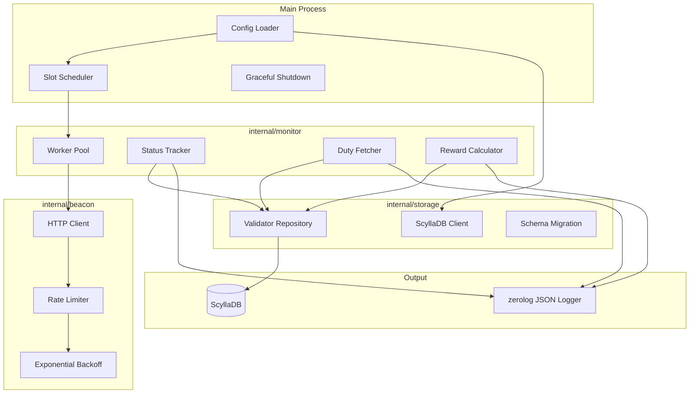
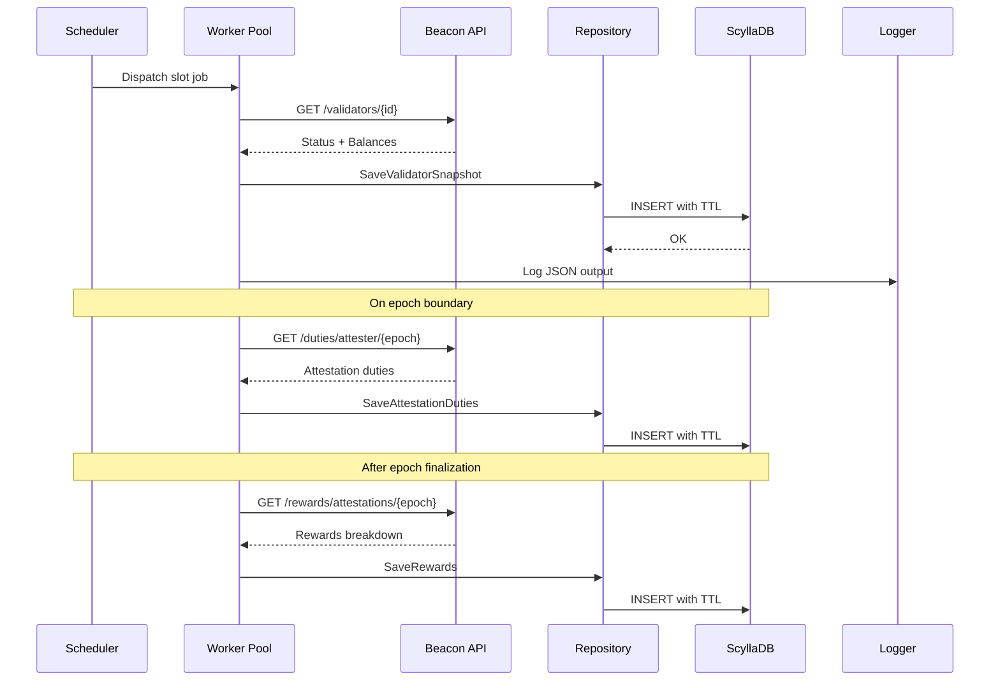
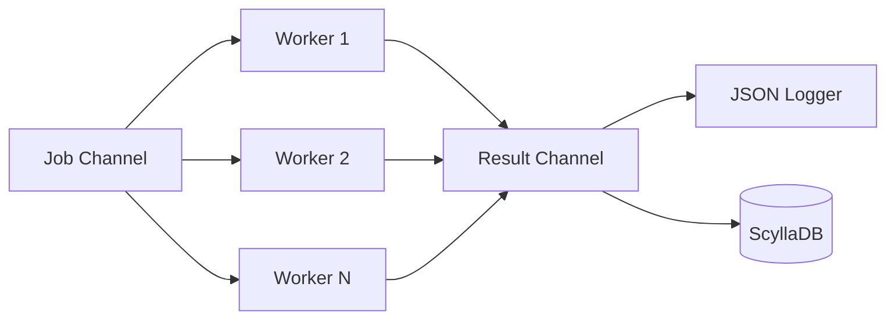

# Pauli - Ethereum Validator Monitor

A high-performance Ethereum validator monitoring service written in Go. Tracks validator status, effective balance, attestation duties, and consensus layer rewards via the Beacon Node API with full persistence to ScyllaDB.

## Features

- **Real-time Monitoring** - Polls validator status and balances every slot (12 seconds)
- **MaxEB Support** - Full EIP-7251 compatibility for effective balances up to 2048 ETH
- **Attestation Tracking** - Monitors duty assignments and reward/penalty breakdowns
- **ScyllaDB Persistence** - Time-series storage with configurable TTL for all metrics
- **Worker Pool** - Concurrent monitoring of 100+ validators without rate limit issues
- **Exponential Backoff** - Graceful handling of 429/503 errors
- **Structured Logging** - JSON output via zerolog for easy parsing

## Prerequisites

- Go 1.24+
- ScyllaDB or Cassandra cluster
- Access to an Ethereum Beacon Node (Lighthouse, Prysm, Teku, etc.)

## Installation

```bash
# Clone the repository
git clone https://github.com/tharun/pauli.git
cd pauli

# Build
go build -o validator-monitor .
```

## Quick Start

1. **Configure ScyllaDB** - Ensure your cluster is running on the configured hosts

2. **Edit config.yaml** - Set your Beacon Node URL and validator indices:

```yaml
beacon_node_url: "http://localhost:5052"
validators:
  - 12345
  - 67890
```

3. **Run the monitor**:

```bash
./validator-monitor -config config.yaml
```

## Usage

```bash
# Run with default config
./validator-monitor -config config.yaml

# Run with debug logging
./validator-monitor -config config.yaml -debug

# Run in background
nohup ./validator-monitor -config config.yaml > monitor.log 2>&1 &
```

## Configuration

```yaml
# Beacon Node API endpoint
beacon_node_url: "http://localhost:5052"

# Validator indices to monitor
validators:
  - 12345
  - 67890
  - 111213

# Polling interval in slots (1 slot = 12 seconds)
polling_interval_slots: 1

# Concurrent workers
worker_pool_size: 10

# Rate limiting
rate_limit:
  requests_per_second: 50
  burst: 100

# HTTP client settings
http:
  timeout_seconds: 30
  max_idle_conns: 100

# ScyllaDB connection
scylladb:
  hosts:
    - "127.0.0.1:9042"
  keyspace: "validator_monitor"
  replication_factor: 3
  consistency: "local_quorum"
  timeout_seconds: 10
  max_retries: 3
  ttl_days: 90
```

## Architecture



## Data Flow



## Project Structure

```
pauli/
├── main.go                      # Entry point with graceful shutdown
├── config.yaml                  # Configuration file
├── internal/
│   ├── config/
│   │   └── config.go            # YAML config loader
│   ├── beacon/
│   │   ├── client.go            # HTTP client with rate limiting
│   │   ├── types.go             # API response structs
│   │   ├── validators.go        # Validator status endpoint
│   │   ├── duties.go            # Attestation duties endpoint
│   │   └── rewards.go           # Attestation rewards endpoint
│   ├── storage/
│   │   ├── scylla.go            # ScyllaDB client and connection
│   │   ├── migrations.go        # Schema auto-migration
│   │   ├── models.go            # Database models
│   │   └── repository.go        # Data access layer
│   └── monitor/
│       ├── monitor.go           # Core monitoring loop
│       ├── worker.go            # Worker pool implementation
│       └── scheduler.go         # Slot-based scheduling
└── pkg/
    └── backoff/
        └── backoff.go           # Exponential backoff utility
```

## Monitoring Logic

| Event | Trigger | Action |
|-------|---------|--------|
| Slot Poll | Every N slots | Fetch validator status and balance |
| Epoch Boundary | First slot of epoch | Fetch attestation duties for next epoch |
| Epoch Finalized | After finalization | Fetch attestation rewards for completed epoch |

## Log Output

The monitor outputs structured JSON logs:

```json
{
  "level": "info",
  "time": "2026-01-16T10:00:00Z",
  "slot": 1234567,
  "validator_index": 12345,
  "status": "active_ongoing",
  "effective_balance_gwei": 64000000000,
  "balance_gwei": 64125000000,
  "msg": "validator_status"
}
```

```json
{
  "level": "info",
  "time": "2026-01-16T10:00:00Z",
  "epoch": 38580,
  "validator_index": 12345,
  "head_reward": 12500,
  "source_reward": 12500,
  "target_reward": 12500,
  "total_reward_gwei": 37500,
  "duty_success": true,
  "msg": "attestation_reward"
}
```

## Database Schema

Four time-series tables optimized for validator queries:

### validator_snapshots
Per-slot balance and status tracking.

```sql
CREATE TABLE validator_snapshots (
    validator_index BIGINT,
    slot            BIGINT,
    status          TEXT,
    balance         BIGINT,
    effective_balance BIGINT,
    timestamp       TIMESTAMP,
    PRIMARY KEY ((validator_index), slot)
) WITH CLUSTERING ORDER BY (slot DESC);
```

### attestation_duties
Per-epoch duty assignments.

```sql
CREATE TABLE attestation_duties (
    validator_index   BIGINT,
    epoch             BIGINT,
    slot              BIGINT,
    committee_index   INT,
    committee_position INT,
    timestamp         TIMESTAMP,
    PRIMARY KEY ((validator_index), epoch, slot)
) WITH CLUSTERING ORDER BY (epoch DESC, slot DESC);
```

### attestation_rewards
Per-epoch rewards breakdown (head, source, target).

```sql
CREATE TABLE attestation_rewards (
    validator_index BIGINT,
    epoch           BIGINT,
    head_reward     BIGINT,
    source_reward   BIGINT,
    target_reward   BIGINT,
    total_reward    BIGINT,
    timestamp       TIMESTAMP,
    PRIMARY KEY ((validator_index), epoch)
) WITH CLUSTERING ORDER BY (epoch DESC);
```

### validator_penalties
Slashing and inactivity penalties.

```sql
CREATE TABLE validator_penalties (
    validator_index BIGINT,
    epoch           BIGINT,
    slot            BIGINT,
    penalty_type    TEXT,
    penalty_gwei    BIGINT,
    timestamp       TIMESTAMP,
    PRIMARY KEY ((validator_index), epoch, slot)
) WITH CLUSTERING ORDER BY (epoch DESC, slot DESC);
```

## HTTP Client Features

- Optimized `net/http` transport with connection pooling
- HTTP/2 enabled by default
- Token bucket rate limiter via `golang.org/x/time/rate`
- Exponential backoff with jitter for 429/503 errors

| Setting | Value |
|---------|-------|
| Max Idle Connections | 100 |
| Idle Connection Timeout | 90s |
| Initial Backoff | 100ms |
| Max Backoff | 30s |
| Backoff Multiplier | 2x |
| Jitter | ±20% |

## Worker Pool



- Fixed pool of N goroutines (configurable)
- Job channel distributes validator indices to workers
- Prevents goroutine explosion when monitoring 100+ validators

## Dependencies

| Package | Purpose |
|---------|---------|
| `github.com/gocql/gocql` | ScyllaDB/Cassandra driver |
| `github.com/rs/zerolog` | High-performance JSON logging |
| `golang.org/x/time/rate` | Token bucket rate limiter |
| `gopkg.in/yaml.v3` | YAML configuration parsing |

## License

MIT
