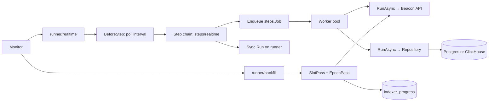

# Pauli - Ethereum Validator Indexing Service

`pauli` indexes validator data from a Beacon Node and persists it to **PostgreSQL** or **ClickHouse** (configurable via `database_driver`).

This project is a data indexing service for validator operations. It is **not** a governance framework or protocol decision system.

## What It Does

- On each poll, reads **chain head** and runs a **linear step chain** (see below)
- Writes **validator snapshots** at the current head slot (async workers)
- Indexes **attestation rewards** at **epoch boundaries** when scheduled (async workers)
- Persists indexed records to the configured backend (TTL / retention via `ttl_days` where applicable)
- Default logs **info** (lifecycle), **warn** (probes / sync), and **errors** (indexing, beacon, runner); use **`-debug`** for verbose request/step logging
- **Realtime** indexes the chain head each poll; optional **backfill** catches up slots and epochs behind head (see `backfill` config)

## Requirements

- Go `1.24+`
- **PostgreSQL** (16+ is typical) or **ClickHouse** (24+; hot retention via table TTL, default 90 days)
- Access to an Ethereum Beacon Node API (Lighthouse, Prysm, Teku, etc.)

## Quick Start

```bash
git clone https://github.com/tharun/pauli.git
cd pauli
go build -o validator-monitor ./cmd/pauli
./validator-monitor -config config.yaml
```

## Config

`database_driver` defaults to `postgres` when omitted (`postgres` or `clickhouse`). ScyllaDB/Cassandra is not supported.

**PostgreSQL example:**

```yaml
beacon_node_url: "http://localhost:5052"
validators:
  - 12345
  - 67890
polling_interval_slots: 1
worker_pool_size: 10

rate_limit:
  requests_per_second: 50
  burst: 100

http:
  timeout_seconds: 30
  max_idle_conns: 100
  max_retries: 3

database_driver: "postgres" # optional; default is postgres

postgres:
  host: "127.0.0.1"
  port: 5432
  user: "pauli"
  password: "pauli"
  database: "validator_monitor"
  ssl_mode: "disable"
  max_conns: 10
  ttl_days: 90
```

**ClickHouse example** (all queries go through ClickHouse):

```yaml
database_driver: clickhouse

clickhouse:
  host: "127.0.0.1"
  port: 9002
  user: "default"
  password: ""
  database: "default"
  max_conns: 10
  ttl_days: 90
```

Fact tables (`validator_epoch_records`, `blocks`) use `TTL ... + INTERVAL 90 DAY DELETE` on local disk. Data older than 90 days is removed from ClickHouse. `indexer_progress` has no TTL. S3/Glacier archival is planned for a later release.

A fuller sample is in `config.example.yaml`. For local Postgres, see `docker.compose.postgres`. For ClickHouse, see `docker.compose.clickhouse`.

## Run Options

```bash
# standard
./validator-monitor -config config.yaml

# debug logs (stdout)
./validator-monitor -config config.yaml -debug

# background
nohup ./validator-monitor -config config.yaml > monitor.log 2>&1 &
```

## REST API binary (`pauli-api`)

`pauli-api` is a separate executable that serves read-only HTTP endpoints backed by the same database as the monitor (`postgres` or `clickhouse`). It does **not** require `beacon_node_url` or `validators` in its config.

Build and run:

```bash
go build -o pauli-api ./cmd/pauli-api
./pauli-api -config config.api.yaml
```

Use **`config.api.yaml`** as a template (`listen` + `database_driver` + storage section).

Endpoints:

- **`GET /healthz`** — returns `200` if the database health check passes, otherwise `503`.
- **`GET /v1/validators/{validatorIndex}/snapshots/latest`** — JSON body is the latest [`ValidatorSnapshot`](internal/storage/models.go) for that index, or `404` if none exists.

## Indexed Data

Pauli currently stores validator-focused epoch data in `validator_epoch_records` (status, balance, effective balance, and attestation rewards per epoch).

## How Indexing Is Scheduled

Indexing uses two runners when backfill is enabled:

- **Realtime** (`runner/realtime`): one head slot per poll (`polling_interval_slots` × slot duration), steps in `steps/realtime`.
- **Backfill** (`runner/backfill`): walks missing slots and epochs up to `head - lag_behind_head`, steps in `steps/backfill`, progress in `indexer_progress`.

See **`doc/monitor-e2e-flow.md`** for diagrams.

### Time and epochs

- **Genesis time** is loaded from the beacon API at startup and stored on **`BlockchainNetwork`** (wall-clock anchor for poll timing).
- **`slot_duration_seconds`** (default **12s**, mainnet) scales the poll interval; use a smaller value on fast devnets (e.g. Kurtosis).
- **32 slots per epoch** (Ethereum consensus); epoch = `slot / 32`.

### Loop pacing (`polling_interval_slots`)

After **`BeforeStep`** (`BlockchainNetwork.WaitPollInterval`), one iteration does:

1. **`StepChain`** returns the same ordered steps every time: **RealtimeEnvBootstrap** → **AttestationRewards** → **BlockIndexer** → **RecordLastProcessedSlot**.
2. **`Env().Reset(ctx)`** clears per-iteration shared state, then each step’s **`Run(env)`** runs on the **runner goroutine**.

So **`polling_interval_slots`** controls **how often** that full chain runs, not “only when slot mod N == 0.”

### Sync vs async steps

- **Sync** (**RealtimeEnvBootstrap**): **`Run`** only fetches **head slot** and copies configured validators into **`Env`**.
- **Sync** (**RecordLastProcessedSlot**): runs **last**; after the rest of the chain ran without error, stores **`lastProcessedSlot`** on the runner so the next poll can **skip** when **`HeadSlot`** is unchanged.
- **Async** steps: each **`Run`** skips when **`HeadSlot == lastProcessedSlot`**; **AttestationRewards** enqueues only at **epoch boundaries** (network-wide epoch index), and **BlockIndexer** enqueues on every new head. Workers call **`Step.RunAsync`**. Heavy I/O runs on the **worker pool** (`worker_pool_size`). **BlockIndexer** calls the beacon block rewards API, sync committee rewards API (all members via empty POST body), and the execution client for priority fees when `execution_node_url` is set **for every new head**—budget RPC capacity accordingly.

### What each step does (current behavior)

| Step | Runner vs worker | Role |
|------|------------------|------|
| **RealtimeEnvBootstrap** | Runner (`Run` only) | Head slot and optional validator list on **`Env`** |
| **AttestationRewards** | Worker (`RunAsync`) | Skips if head already recorded; at epoch boundary indexes **all validators** (1 GET + 1 POST per epoch) into **`validator_epoch_records`** |
| **BlockIndexer** | Worker (`RunAsync`) | Skips if head already recorded; indexes the canonical head block (proposer, CL rewards, all sync committee rewards as JSONB on **`blocks`**, optional EL priority fees) |
| **RecordLastProcessedSlot** | Runner (`Run` only) | Sets runner **`lastProcessedSlot`** to **`Env.HeadSlot`** after a successful chain pass |

**BlockIndexer** also calls **`MarkSlotIndexed`** after a successful async write (shared with backfill).

### Backfill runner (`backfill.enabled: true`)

| Track | Steps | Progress |
|-------|-------|----------|
| **Slots** | **SlotPass** → shared block indexer (`steps/indexing`) | `indexer_progress` kind `slot` (includes empty slots) |
| **Epochs** | **EpochPass** → network-wide epoch records (balances + attestation rewards, one table) | `indexer_progress` kind `epoch` |

When backfill is caught up, **`idle_poll_delay_ms`** (default 12s) reduces idle beacon polling.

Tune **`slots_per_pass`**, **`epochs_per_pass`**, and **`worker_pool_size`** so backfill does not starve realtime RPC.

One-shot historic jobs: **`go run ./cmd/pauli-backfill`** with `-from-slot`, `-to-slot`, `-from-epoch`, `-to-epoch` (see `config.example.yaml`).

## High-Level Flow


```mermaid
flowchart LR
    A[Monitor] --> B[runner/realtime]
    A --> BF[runner/backfill]
    B --> C[BeforeStep: poll interval]
    C --> D[Step chain: steps/realtime]
    D --> E[Sync Run on runner]
    D --> F[Enqueue steps.Job]
    F --> G[Worker pool]
    G --> H[RunAsync → Beacon API]
    BF --> I[SlotPass + EpochPass]
    I --> H
    G --> J[RunAsync → Repository]
    I --> K[(indexer_progress)]
    J --> L[(Postgres or ClickHouse)]
```

## Project Layout

```
pauli/
├── cmd/
│   ├── pauli/                # validator monitor binary
│   ├── pauli-api/            # REST API binary (read storage backend)
│   ├── pauli-backfill/       # one-shot historical slot/epoch backfill
│   └── devnet-equivocate/    # Kurtosis-only: post conflicting attestations (requires exported BLS secret)
├── config.yaml
├── doc/
│   └── monitor-e2e-flow.md   # monitor/runner/steps/queue sequence diagrams
├── internal/
│   ├── api/                  # HTTP handlers for pauli-api
│   ├── beacon/               # Beacon API client + endpoint handlers
│   ├── config/               # YAML config loading/validation + BlockchainNetwork
│   ├── logsetup/             # shared zerolog setup for binaries
│   ├── monitor/
│   │   ├── monitor.go        # wires pool + realtime runner
│   │   ├── queue/            # worker pool; runs Step.RunAsync via steps.Job
│   │   ├── runner/           # generic Run loop (BeforeStep → chain → Enqueue)
│   │   ├── runner/realtime/  # pacing + StepChain implementation
│   │   └── steps/            # Step, Env, Job
│   │       └── steps/realtime/  # concrete indexing steps
│   ├── storage/              # Store/Repository interfaces + models
│   ├── storage/postgres/
│   ├── storage/clickhouse/
│   └── store/                # database driver factory
├── sql/
│   ├── migrations_pg/
│   └── migrations_ch/
├── scripts/
│   └── kurtosis/             # env helpers + EL tx spam for Kurtosis devnets
└── pkg/
    └── backoff/              # retry/backoff utility
```
## Kurtosis 

[`krutosis-config/kurtosis-param.yaml`](krutosis-config/kurtosis-param.yaml) runs a **single archive participant** (Geth `el_storage_type: archive`, Lighthouse `--reconstruct-historic-states`, checkpoint sync disabled) so Pauli backfill can query historic beacon states (e.g. `/eth/v1/beacon/states/{slot}/validators`).

```bash
kurtosis run --enclave pauli-dev-network github.com/ethpandaops/ethereum-package --args-file ./krutosis-config/kurtosis-param.yaml
```

After the enclave is up, point `beacon_node_url` / `execution_node_url` in your Pauli config at the CL/EL ports (`source scripts/kurtosis/env.sh` for URLs). Allow the node to advance past the slots you backfill; historic states for a slot exist once the chain has processed that slot with reconstruction enabled.

Helper scripts for EL traffic and devnet slashing tests live under [`scripts/kurtosis/`](scripts/kurtosis/): source [`scripts/kurtosis/env.sh`](scripts/kurtosis/env.sh) for beacon and EL URLs (via `kurtosis port print`), run [`scripts/kurtosis/spam-tx.sh`](scripts/kurtosis/spam-tx.sh) with `PRIVATE_KEY` set to a prefunded account, optionally [`scripts/kurtosis/burst-around-proposer.sh`](scripts/kurtosis/burst-around-proposer.sh) around a validator’s proposal slots, and build [`cmd/devnet-equivocate`](cmd/devnet-equivocate) (`go build -o devnet-equivocate ./cmd/devnet-equivocate`) to post conflicting attestations using a BLS secret exported from the enclave (never commit keys).

## Notes

- Built for validator indexing and operational visibility
- **Beacon HTTP retries** use **`http.max_retries`** (default 3).
- Uses rate limiting and exponential backoff to reduce node/API pressure
- Supports Max Effective Balance flows (EIP-7251 context) through Beacon data indexing
- **Architecture detail:** `doc/monitor-e2e-flow.md` matches the current monitor implementation; treat it as the source of truth for control flow

## License

MIT
