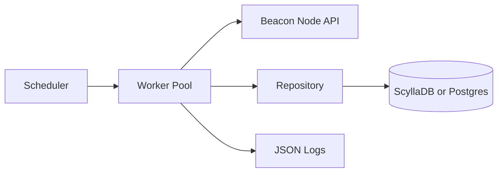

# Pauli - Ethereum Validator Indexing Service

`pauli` indexes validator data from a Beacon Node and persists it to **ScyllaDB/Cassandra** or **PostgreSQL** (chosen via `database_driver`).

This project is a data indexing service for validator operations. It is **not** a governance framework or protocol decision system.

## What It Does

- Polls validator status and balances on a slot schedule
- Indexes attestation duties at epoch boundaries
- Indexes attestation rewards after finalization
- Persists indexed records to the configured backend (TTL / retention via `ttl_days` where applicable)
- Emits structured JSON logs for ops and debugging

## Requirements

- Go `1.24+`
- One of: **ScyllaDB/Cassandra** or **PostgreSQL** (16+ is typical)
- Access to an Ethereum Beacon Node API (Lighthouse, Prysm, Teku, etc.)

## Quick Start

```bash
git clone https://github.com/tharun/pauli.git
cd pauli
go build -o validator-monitor .
./validator-monitor -config config.yaml
```

## Config

Set `database_driver` to `"scylladb"` (default if omitted) or `"postgres"`. Only the block for the active driver needs to match your environment; you can keep both in one file for switching.

**ScyllaDB / Cassandra**

```yaml
beacon_node_url: "http://localhost:5052"
validators:
  - 12345
  - 67890
polling_interval_slots: 1
worker_pool_size: 10

rate_limit:
  requests_per_second: 50
  burst: 100

database_driver: "scylladb" # or omit; empty defaults to scylladb

scylladb:
  hosts:
    - "127.0.0.1:9042"
  keyspace: "validator_monitor"
  replication_factor: 3
  consistency: "local_quorum"
  timeout_seconds: 10
  max_retries: 3
  ttl_days: 90
```

**PostgreSQL**

```yaml
beacon_node_url: "http://localhost:5052"
validators:
  - 12345
  - 67890
polling_interval_slots: 1
worker_pool_size: 10

rate_limit:
  requests_per_second: 50
  burst: 100

database_driver: "postgres"

postgres:
  host: "127.0.0.1"
  port: 5432
  user: "pauli"
  password: "pauli"
  database: "validator_monitor"
  ssl_mode: "disable"
  max_conns: 10
  ttl_days: 90
```

A full example with both backends is in `config.yaml`. For local Postgres, see `docker.compose.postgres`.

## Run Options

```bash
# standard
./validator-monitor -config config.yaml

# verbose logs
./validator-monitor -config config.yaml -debug

# background
nohup ./validator-monitor -config config.yaml > monitor.log 2>&1 &
```

## Indexed Data

Pauli currently stores four validator-focused datasets:

- `validator_snapshots`: status, balance, effective balance per slot
- `attestation_duties`: duty assignment data per epoch/slot
- `attestation_rewards`: head/source/target rewards per epoch
- `validator_penalties`: slashing/inactivity penalty records

## How Indexing Is Scheduled

Indexing is driven by a **reconciliation loop**, not a single tick per slot. The service keeps cursors in memory and catches up to chain head on each pass, with limits per pass so the beacon node isn’t hammered after downtime.

### Time and epochs

- **Genesis time** comes from the beacon API; slots are derived from elapsed time and **`slot_duration_seconds`** (default **12s**, mainnet—use a smaller value on fast devnets, e.g. Kurtosis).
- **32 slots per epoch** (Ethereum consensus); epoch = `slot / 32`.

### Loop pacing (`polling_interval_slots`)

After each iteration, the loop sleeps for **`polling_interval_slots` × slot duration**, then:

1. Reads **head slot** from the node (with a small cache).
2. Runs reconciliation for **snapshots**, **duties**, and **rewards** (below).

So “every N slots” means **how often a full reconciliation pass runs**, not “only fetch slot S when S mod N == 0.”

### Validator snapshots (per-slot state)

- Cursor: last processed snapshot slot (initialized to **head slot** on startup, then advances as the chain moves).
- Each pass: process slots **`lastSnapshotSlot + 1` … `headSlot`**, in order.
- **Cap:** at most **32 slots** per pass; remaining slots are picked up on later passes.
- For each slot: fetch **validator status / balances** for all configured indices (worker pool + rate limit).

### Attestation duties

- Cursor: last epoch for which duties were indexed.
- Each pass: advance toward **`currentEpoch + 1`** (from head), where `currentEpoch = headSlot / 32`, so duties for the **next** epoch the chain is entering are covered.
- **Cap:** at most **8 epochs** of duty work per pass.

### Attestation rewards (and derived penalties)

- Rewards are only meaningful once an epoch is **finalized**. The loop reads the beacon **finalized checkpoint** and advances the rewards cursor from **`lastRewardsEpoch + 1` … `finalizedEpoch`**.
- **Cap:** at most **8 epochs** of reward fetches per pass.
- On startup, the rewards cursor is seeded from **current finalized epoch** so the process doesn’t try to replay the entire chain history.
- **Penalties** in storage are written when processing reward results (e.g. missed attestation / negative net reward)—same reconciliation pass as rewards, not a separate schedule.

### Summary

| Work stream | What moves forward | Beacon inputs |
|-------------|-------------------|----------------|
| Snapshots | Unprocessed slots up to head | Head slot, validator APIs |
| Duties | Epochs up to `currentEpoch + 1` | Duties for target epochs |
| Rewards | Finalized epochs only | Finality checkpoints + rewards API |

## High-Level Flow


```mermaid
flowchart LR
    A[Scheduler] --> B[Worker Pool]
    B --> C[Beacon Node API]
    B --> D[Repository]
    D --> E[(ScyllaDB or Postgres)]
    B --> F[JSON Logs]
```

## Project Layout

```
pauli/
├── main.go
├── config.yaml
├── internal/
│   ├── beacon/      # Beacon API client + endpoint handlers
│   ├── config/      # YAML config loading/validation
│   ├── monitor/     # scheduler + workers + indexing loop
│   ├── storage/     # Store/Repository interfaces + models
│   ├── storage/scylladb/
│   ├── storage/postgres/
│   └── store/       # picks backend from database_driver
├── sql/
│   ├── migrations/     # CQL for Scylla
│   └── migrations_pg/ # SQL for Postgres
└── pkg/
    └── backoff/     # retry/backoff utility
```

## Notes

- Built for validator indexing and operational visibility
- Uses rate limiting and exponential backoff to reduce node/API pressure
- Supports Max Effective Balance flows (EIP-7251 context) through Beacon data indexing

## License

MIT
