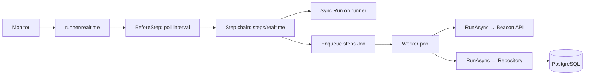

# Pauli - Ethereum Validator Indexing Service

`pauli` indexes validator data from a Beacon Node and persists it to **PostgreSQL**.

This project is a data indexing service for validator operations. It is **not** a governance framework or protocol decision system.

## What It Does

- On each poll, reads **chain head** and runs a **linear step chain** (see below)
- Writes **validator snapshots** at the current head slot (async workers)
- Plans **duties** and **rewards** epochs at **slot/epoch boundaries** and indexes them when scheduled (async workers)
- Persists indexed records to the configured backend (TTL / retention via `ttl_days` where applicable)
- Default logs **info** (lifecycle), **warn** (probes / sync), and **errors** (indexing, beacon, runner); use **`-debug`** for verbose request/step logging
- **No historical catch-up** yet: one realtime pass per poll, not a multi-slot reconciliation cursor

## Requirements

- Go `1.24+`
- **PostgreSQL** (16+ is typical)
- Access to an Ethereum Beacon Node API (Lighthouse, Prysm, Teku, etc.)

## Quick Start

```bash
git clone https://github.com/tharun/pauli.git
cd pauli
go build -o validator-monitor .
./validator-monitor -config config.yaml
```

## Config

`database_driver` defaults to `postgres` when omitted. ScyllaDB/Cassandra is not supported.

```yaml
beacon_node_url: "http://localhost:5052"
validators:
  - 12345
  - 67890
polling_interval_slots: 1
worker_pool_size: 10

rate_limit:
  requests_per_second: 50
  burst: 100

http:
  timeout_seconds: 30
  max_idle_conns: 100
  max_retries: 3

database_driver: "postgres" # optional; default is postgres

postgres:
  host: "127.0.0.1"
  port: 5432
  user: "pauli"
  password: "pauli"
  database: "validator_monitor"
  ssl_mode: "disable"
  max_conns: 10
  ttl_days: 90
```

A fuller sample is in `config.example.yaml`. For local Postgres, see `docker.compose.postgres`.

## Run Options

```bash
# standard
./validator-monitor -config config.yaml

# debug logs (stdout)
./validator-monitor -config config.yaml -debug

# background
nohup ./validator-monitor -config config.yaml > monitor.log 2>&1 &
```

## Indexed Data

Pauli currently stores four validator-focused datasets:

- `validator_snapshots`: status, balance, effective balance per slot
- `attestation_duties`: duty assignment data per epoch/slot
- `attestation_rewards`: head/source/target rewards per epoch
- `validator_penalties`: slashing/inactivity penalty records

## How Indexing Is Scheduled

Indexing is driven by a **realtime runner loop** (`internal/monitor/runner` + `runner/realtime`), not a multi-slot reconciliation cursor. Each cycle waits for **`polling_interval_slots` × slot duration**, then runs a fixed **chain of steps** from `internal/monitor/steps/realtime`. For package-level flow diagrams, see **`doc/monitor-e2e-flow.md`**.

### Time and epochs

- **Genesis time** is loaded from the beacon API at startup and stored on **`BlockchainNetwork`** (wall-clock anchor for poll timing).
- **`slot_duration_seconds`** (default **12s**, mainnet) scales the poll interval; use a smaller value on fast devnets (e.g. Kurtosis).
- **32 slots per epoch** (Ethereum consensus); epoch = `slot / 32`.

### Loop pacing (`polling_interval_slots`)

After **`BeforeStep`** (`BlockchainNetwork.WaitPollInterval`), one iteration does:

1. **`StepChain`** returns the same ordered steps every time: **GetValidatorDetails** → **ValidatorsBalanceAtSlot** → **ValidatorDuties** → **AttestationRewardsAtBoundary**.
2. **`Env().Reset(ctx)`** clears per-iteration shared state, then each step’s **`Run(env)`** runs on the **runner goroutine**.

So **`polling_interval_slots`** controls **how often** that full chain runs, not “only when slot mod N == 0.”

### Sync vs async steps

- **Sync** (**GetValidatorDetails**): fetches **head slot**, copies configured validators into **`Env`**, and at **epoch boundaries** (first or last slot of an epoch, with **dedup** via runner-owned **`lastEpoch`**) sets **`Env.DutiesEpoch`** / **`Env.RewardsEpoch`** when work is planned.
- **Async** steps: **`Run`** returns whether to **enqueue** a **`steps.Job`** (the step plus a **cloned `Env`**). Workers call **`Step.RunAsync`** and talk to the beacon node + repository. Heavy I/O runs on the **worker pool** (`worker_pool_size`).

### What each step does (current behavior)

| Step | Runner vs worker | Role |
|------|------------------|------|
| **GetValidatorDetails** | Runner (sync) | Head slot, validator list on **`Env`**, boundary plan for duties/rewards epochs |
| **ValidatorsBalanceAtSlot** | Worker (`RunAsync`) | Batched validator state at **`Env.HeadSlot`** → snapshots |
| **ValidatorDuties** | Worker (`RunAsync`) | Attester duties for **`Env.DutiesEpoch`** when set; skipped when nil |
| **AttestationRewardsAtBoundary** | Worker (`RunAsync`) | Rewards (and derived penalties) for **`Env.RewardsEpoch`** when set; skipped when nil |

**Penalties** are still written from reward processing when net reward is negative; there is no separate penalty scheduler.

### Out of scope today

- **Historical backfill** / catch-up over many slots or epochs in one process is **not** implemented; the README’s older “cursor + cap per pass” description referred to a design that is **not** in the current tree.

## High-Level Flow


```mermaid
flowchart LR
    A[Monitor] --> B[runner/realtime]
    B --> C[BeforeStep: poll interval]
    C --> D[Step chain: steps/realtime]
    D --> E[Sync Run on runner]
    D --> F[Enqueue steps.Job]
    F --> G[Worker pool]
    G --> H[RunAsync → Beacon API]
    G --> I[RunAsync → Repository]
    I --> J[(PostgreSQL)]
```

## Project Layout

```
pauli/
├── main.go
├── config.yaml
├── doc/
│   └── monitor-e2e-flow.md   # monitor/runner/steps/queue sequence diagrams
├── internal/
│   ├── beacon/               # Beacon API client + endpoint handlers
│   ├── config/               # YAML config loading/validation + BlockchainNetwork
│   ├── monitor/
│   │   ├── monitor.go        # wires pool + realtime runner
│   │   ├── queue/            # worker pool; runs Step.RunAsync via steps.Job
│   │   ├── runner/           # generic Run loop (BeforeStep → chain → Enqueue)
│   │   ├── runner/realtime/  # pacing + StepChain implementation
│   │   └── steps/            # Step, Env, Job
│   │       └── steps/realtime/  # concrete indexing steps
│   ├── storage/              # Store/Repository interfaces + models
│   ├── storage/postgres/
│   └── store/                # wires PostgreSQL store
├── sql/
│   └── migrations_pg/        # SQL migrations
└── pkg/
    └── backoff/              # retry/backoff utility
```

## Notes

- Built for validator indexing and operational visibility
- **Beacon HTTP retries** use **`http.max_retries`** (default 3).
- Uses rate limiting and exponential backoff to reduce node/API pressure
- Supports Max Effective Balance flows (EIP-7251 context) through Beacon data indexing
- **Architecture detail:** `doc/monitor-e2e-flow.md` matches the current monitor implementation; treat it as the source of truth for control flow

## License

MIT
